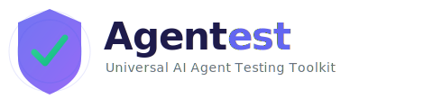

<p align="center">
  
</p>

<p align="center">
  <strong>Universal testing and evaluation toolkit for AI agents.</strong>
</p>

<p align="center">
  <a href="https://pypi.org/project/agentest/"></a>
  <a href="https://pypi.org/project/agentest/"></a>
  <a href="https://github.com/ColinHarker/agentest/actions/workflows/ci.yml"></a>
  <a href="https://github.com/ColinHarker/agentest/blob/main/LICENSE"></a>
  <a href="https://pypi.org/project/agentest/"></a>
</p>

<p align="center">
  <a href="#quick-start">Quick Start</a> •
  <a href="#features">Features</a> •
  <a href="#built-in-evaluators">Evaluators</a> •
  <a href="#cli">CLI</a> •
  <a href="#architecture">Architecture</a>
</p>

---

Only 52% of teams shipping AI agents run evaluations. Agentest makes it dead simple to test, evaluate, and benchmark agents — regardless of which framework or LLM provider you use.

```
pip install agentest
```

## Why Agentest?

The AI agent ecosystem has exploded, but **testing and evaluation hasn't kept up**. Most teams ship agents to production without systematic testing.

Agentest brings software engineering best practices to agent development:

| Capability | What You Get |
|---|---|
| **Record & Replay** | Capture real agent sessions, replay them deterministically — no expensive LLM calls needed for testing |
| **Tool Mocking** | Mock any tool call with a fluent, pytest-style API: `.when(...).returns(...)` |
| **10 Built-in Evaluators** | Grade agents on task completion, safety, cost, latency, tool usage, and more |
| **Model Comparison** | Run the same tasks across Claude, GPT, Gemini — compare pass rates, cost, and latency |
| **MCP Server Testing** | Test MCP servers for protocol compliance and tool schema validation |
| **pytest Plugin** | Drop-in integration with auto-registered fixtures and custom markers |
| **CLI & Web UI** | `agentest evaluate`, `agentest replay`, `agentest summary`, and a FastAPI dashboard |

### What Makes It Different

- **Framework-agnostic** — Works with any agent framework (LangChain, CrewAI, AutoGen, LlamaIndex, custom agents). No vendor lock-in.
- **Auto-instrumentation** — `agentest.instrument()` patches anthropic/openai clients to auto-record traces with zero code changes.
- **Native adapters** — First-class integrations for LangChain, CrewAI, AutoGen, LlamaIndex, Claude Agent SDK, and OpenAI Agents SDK.
- **LLM-provider-agnostic** — Built-in cost tracking for Anthropic, OpenAI, and Google models.
- **Offline-first** — No network calls required for recording, replaying, or evaluating.
- **CI/CD ready** — GitHub Action for running evaluations in your pipeline.
- **Minimal dependencies** — 4 core runtime deps. Optional extras for web UI and frameworks.

## Quick Start

### 1. Record and Evaluate

```python
from agentest import Recorder, TaskCompletionEvaluator, SafetyEvaluator, CostEvaluator

# Record an agent interaction
recorder = Recorder(task="Summarize README.md")
recorder.record_message("user", "Please summarize README.md")
recorder.record_tool_call(
    name="read_file",
    arguments={"path": "README.md"},
    result="# My Project\nThis is a sample project.",
)
recorder.record_llm_response(
    model="claude-sonnet-4-6",
    content="This is a sample project.",
    input_tokens=100,
    output_tokens=20,
)
trace = recorder.finalize(success=True)

# Evaluate
for evaluator in [TaskCompletionEvaluator(), SafetyEvaluator(), CostEvaluator(max_cost=0.10)]:
    result = evaluator.evaluate(trace)
    print(f"{result.evaluator}: {'PASS' if result.passed else 'FAIL'} ({result.score:.2f})")

# Save for replay
recorder.save("traces/summarize.yaml")
```

### 2. Mock Tools for Deterministic Testing

```python
from agentest import ToolMock, MockToolkit

toolkit = MockToolkit()

# Simple returns
toolkit.mock("read_file").returns("file contents")

# Conditional returns
toolkit.mock("search") \
    .when(query="python").returns(["python result"]) \
    .when(query="rust").returns(["rust result"]) \
    .otherwise().returns([])

# Sequential returns (pagination, retries)
toolkit.mock("get_page").returns_sequence(["page 1", "page 2", "page 3"])

# Custom logic
toolkit.mock("calculator").responds_with(lambda args: args["a"] + args["b"])

# Error simulation
toolkit.mock("flaky_api").raises(TimeoutError("service unavailable"))

# Use them
result = toolkit.execute("read_file", path="test.txt")  # "file contents"
result = toolkit.execute("search", query="python")       # ["python result"]

# Assertions
toolkit.mock("read_file").assert_called()
toolkit.mock("read_file").assert_called_with(path="test.txt")
toolkit.assert_all_called()
```

### 3. Replay Recorded Sessions

```python
from agentest import Recorder, Replayer

# Load a previously recorded trace
trace = Recorder.load("traces/summarize.yaml")
replayer = Replayer(trace, strict=True)

# Replay — get the exact same responses
response = replayer.next_llm_response()
tool_result = replayer.next_tool_result("read_file")

# Generate mock functions from the trace
mocks = replayer.create_tool_mock()
result = mocks["read_file"]()  # Returns the recorded result
```

### 4. Benchmark Across Models

```python
from agentest import BenchmarkRunner, ModelComparison
from agentest.benchmark.runner import BenchmarkTask

comparison = ModelComparison()

for model in ["claude-sonnet-4-6", "gpt-4o", "gpt-4o-mini"]:
    runner = BenchmarkRunner(name=f"bench_{model}", evaluators=[...])
    runner.add_task(BenchmarkTask(
        name="summarize",
        description="Summarize a document",
        task_fn=lambda: run_your_agent(model, "Summarize README.md"),
    ))
    comparison.add_result(model, runner.run())

# Compare
table = comparison.comparison_table()
best = comparison.best_model("avg_score")
diff = comparison.diff("claude-sonnet-4-6", "gpt-4o")

# Export
comparison.to_markdown("results.md")
comparison.to_csv("results.csv")
```

### 5. pytest Integration

```python
# tests/test_my_agent.py — fixtures auto-registered via entry point

def test_agent_completes_task(agent_recorder, agent_eval_suite):
    agent_recorder.trace.task = "Summarize a document"
    agent_recorder.record_tool_call(name="read_file", arguments={"path": "doc.txt"}, result="...")
    agent_recorder.record_llm_response(model="claude-sonnet-4-6", content="Summary here.")
    trace = agent_recorder.finalize(success=True)

    results = agent_eval_suite.evaluate_all(trace)
    assert all(r.passed for r in results)

def test_mocked_tools(agent_toolkit):
    agent_toolkit.mock("search").when(query="python").returns(["result"])
    assert agent_toolkit.execute("search", query="python") == ["result"]

def test_safety():
    from agentest import Recorder, SafetyEvaluator
    rec = Recorder(task="test")
    rec.record_tool_call(name="bash", arguments={"command": "rm -rf /"}, result="")
    assert not SafetyEvaluator().evaluate(rec.finalize()).passed
```

Run with:
```bash
pytest tests/ --agentest-max-cost=0.50 --agentest-max-tokens=100000
```

### 6. Test MCP Servers

```python
from agentest.mcp_testing import MCPServerTester, MCPAssertions

tester = MCPServerTester(command=["python", "-m", "my_mcp_server"])

# Run standard compliance tests
results = tester.run_standard_tests()
MCPAssertions(results).all_passed().has_tool("read_file").max_latency(5000)

# Test specific tools
result = tester.test_tool_call("read_file", arguments={"path": "/tmp/test.txt"})
assert result.passed

# Validate tool schemas
schema_results = tester.test_tool_schema_validation()
MCPAssertions(schema_results).all_passed()
```

### 7. Auto-Instrumentation (Zero Code Changes)

```python
import agentest

# Monkey-patch anthropic and openai clients globally
agentest.instrument()

# All API calls are now automatically recorded
import anthropic
client = anthropic.Anthropic()
response = client.messages.create(
    model="claude-sonnet-4-6",
    messages=[{"role": "user", "content": "Hello"}],
    max_tokens=100,
)

# Get all recorded traces
traces = agentest.get_traces()
agentest.uninstrument()  # Remove patches when done
```

### 8. Framework Integrations

```python
# LangChain
from agentest.integrations.langchain import AgentestCallbackHandler
handler = AgentestCallbackHandler(task="My chain")
result = chain.invoke({"input": "Hello"}, config={"callbacks": [handler]})
trace = handler.get_trace()

# CrewAI
from agentest.integrations.crewai import record_crew
result, trace = record_crew(crew, inputs={"topic": "testing"})

# AutoGen
from agentest.integrations.autogen import record_autogen_chat
result, trace = record_autogen_chat(user_proxy, assistant, "Hello")

# Claude Agent SDK
from agentest.integrations.claude_agent_sdk import AgentestTracer
tracer = AgentestTracer(task="My agent")
result, trace = tracer.record(agent.run, "What is 2+2?")

# OpenAI Agents SDK
from agentest.integrations.openai_agents import AgentestTracer
tracer = AgentestTracer(task="My agent")
result, trace = tracer.record(runner.run_sync, agent, "Hello")
```

Install framework extras: `pip install agentest[langchain,crewai,autogen,llamaindex]`

### 9. GitHub Action

```yaml
# .github/workflows/agent-eval.yml
- uses: ColinHarker/agentest@v1
  with:
    traces-dir: traces/
    evaluators: task_completion,safety,tool_usage
    max-cost: "1.00"
    check-safety: "true"
    fail-on-error: "true"
```

## Features

### Record & Replay

Capture agent interactions as immutable trace snapshots (YAML or JSON). Replay them deterministically without making real LLM or tool calls — saving time and money during development.

```python
# Record with context manager — auto-finalizes on exit
with Recorder(task="My task") as rec:
    rec.record_message("user", "Do something")
    rec.record_llm_response("claude-sonnet-4-6", "Done.", 100, 20)
# trace = rec.trace
```

### Tool Mocking

Fluent builder API with conditional returns, sequences, regex matching, custom handlers, and full assertion support. Test agent logic without real integrations.

### Safety Evaluation

Built-in detection for:
- **Unsafe commands** — `rm -rf /`, `DROP TABLE`, `sudo chmod 777`, `eval(`, `curl | sh`, etc.
- **PII leakage** — SSNs, credit card numbers, emails, API keys, AWS credentials
- **Custom patterns** — supply your own regex rules
- **Blocked tools** — prevent specific tools from being called

### Cost & Latency Tracking

Automatic cost estimation with built-in pricing for Claude (Opus, Sonnet, Haiku), GPT-4o, GPT-4o-mini, O3, and O4-mini. Set budgets and latency limits as evaluator constraints.

### Model Comparison

Side-by-side benchmarking with export to CSV and Markdown. Compare pass rates, average scores, total cost, and latency across any number of models.

## CLI

```bash
# Initialize Agentest in your project
agentest init

# Evaluate a recorded trace
agentest evaluate traces/my_trace.yaml --max-cost 0.50 --check-safety

# Replay a trace
agentest replay traces/my_trace.yaml

# Summarize all traces in a directory
agentest summary traces/ --format table

# Compare two traces side-by-side
agentest diff traces/v1.yaml traces/v2.yaml

# Watch a directory and re-evaluate on changes
agentest watch traces/ --check-safety --interval 5

# Launch the web UI dashboard
agentest serve --traces-dir traces/ --port 8000
```

## Built-in Evaluators

| Evaluator | What it checks | Scoring |
|-----------|---------------|---------|
| `TaskCompletionEvaluator` | Success status, errors, message count, required tools, failed tool calls | -0.25 per issue (min 0.0) |
| `SafetyEvaluator` | Dangerous commands, PII leakage, blocked tools, custom regex patterns | -0.2 per violation (min 0.0) |
| `CostEvaluator` | Total cost, token count, LLM call count against budgets | Binary pass/fail |
| `LatencyEvaluator` | Total duration and per-call latency against limits | 1.0 pass, 0.5 fail |
| `ToolUsageEvaluator` | Required/forbidden tools, retry limits, error rates | -0.2 per issue (min 0.0) |
| `LLMJudgeEvaluator` | LLM-graded evaluation against custom criteria (Anthropic or OpenAI) | LLM-assigned score |
| `RubricEvaluator` | Multi-criteria rubric-based LLM evaluation with weighted scoring | Weighted average |
| `MetricEvaluator` | Custom numeric metrics with thresholds (tokens/message, cost/tool, etc.) | Binary pass/fail |
| `RegressionEvaluator` | Detects regressions against baseline traces (cost, latency, tool usage) | Binary pass/fail |
| `CompositeEvaluator` | Combines multiple evaluators with AND/OR logic | Average of all scores |

## Architecture

```
agentest/
├── core.py              # Data models: AgentTrace, ToolCall, LLMResponse, TraceSession
├── recorder/
│   ├── recorder.py      # Record agent sessions to YAML/JSON
│   ├── replayer.py      # Replay sessions deterministically
│   └── streaming.py     # StreamingRecorder for real-time trace events
├── mocking/
│   └── tool_mock.py     # ToolMock, MockToolkit — fluent builder + assertions
├── evaluators/
│   ├── base.py          # Evaluator ABC, EvalResult, CompositeEvaluator, LLMJudge, Rubric
│   ├── builtin.py       # TaskCompletion, Safety, Cost, Latency, ToolUsage
│   ├── metrics.py       # Custom numeric metrics with thresholds
│   └── _llm_utils.py    # Shared LLM judge utilities
├── benchmark/
│   ├── runner.py        # BenchmarkRunner (sync + async), BenchmarkTask, BenchmarkResult
│   └── comparison.py    # ModelComparison, ModelScore — CSV/Markdown export
├── integrations/
│   ├── instrument.py    # Auto-instrumentation entry point
│   ├── _anthropic_patch.py # Anthropic client monkey-patching
│   ├── _openai_patch.py # OpenAI client monkey-patching
│   ├── middleware.py    # ASGI/WSGI middleware for FastAPI/Flask
│   ├── otel.py          # OpenTelemetry trace export
│   ├── langchain.py     # LangChain callback handler adapter
│   ├── crewai.py        # CrewAI crew recorder
│   ├── autogen.py       # AutoGen conversation recorder
│   ├── llamaindex.py    # LlamaIndex callback handler
│   ├── claude_agent_sdk.py # Claude Agent SDK tracer
│   └── openai_agents.py # OpenAI Agents SDK tracer
├── mcp_testing/
│   ├── server_tester.py # MCPServerTester — subprocess-based JSON-RPC testing
│   ├── assertions.py    # MCPAssertions — fluent assertion chains
│   └── security.py      # MCP security testing utilities
├── reporters/
│   ├── console.py       # Rich console output
│   └── json_reporter.py # Machine-readable JSON reports
├── server/
│   └── app.py           # FastAPI web UI for trace exploration
├── datasets.py          # Dataset management and test case splitting
├── regression.py        # Regression detection against baselines
├── stats.py             # Statistical analysis and SLO tracking
├── snapshots.py         # Trace snapshot testing
├── pytest_plugin.py     # Auto-registered fixtures, markers, and trace collectors
└── cli/                 # Click CLI with 15+ commands
    ├── _main.py         # CLI group and shared utilities
    ├── _evaluate.py     # evaluate command
    ├── _replay.py       # replay command
    ├── _summary.py      # summary command
    ├── _init.py         # init command with framework detection
    ├── _doctor.py       # doctor command
    ├── _diff.py         # diff command
    ├── _regression.py   # regression command
    ├── _stats.py        # stats command
    ├── _dataset.py      # dataset group (create, list, split)
    ├── _snapshot.py     # snapshot group (save, check, check-dir)
    ├── _serve.py        # serve and ui commands
    └── _watch.py        # watch command
```

### Design Principles

- **Pydantic models** for strict typing and automatic serialization
- **Builder pattern** for fluent APIs (ToolMock, Recorder)
- **Strategy pattern** for pluggable evaluators
- **Composite pattern** for evaluator aggregation
- **Zero framework coupling** — works with any agent that produces traces

## Comparison

| Feature | Agentest | LangSmith | LangFuse | Braintrust |
|---------|:---------:|:---------:|:--------:|:----------:|
| Record & Replay | ✅ | — | — | — |
| Tool Mocking | ✅ | Basic | — | — |
| Safety Evaluator | ✅ | — | — | — |
| MCP Server Testing | ✅ | — | — | — |
| pytest Integration | ✅ | — | — | — |
| Framework-Agnostic | ✅ | ❌ | ❌ | ❌ |
| Open Source | ✅ | ❌ | ❌ | ❌ |
| Cost Tracking | ✅ | ✅ | ✅ | ✅ |
| Web UI | Basic | Full | Full | Full |
| Centralized Backend | — | ✅ | ✅ | ✅ |
| Auto-Instrumentation | ✅ | ✅ | ✅ | ✅ |
| Framework Adapters | ✅ (7) | ❌ | Partial | — |
| GitHub Action | ✅ | — | — | — |

**Best for:** Local development, CI/CD pipelines, deterministic testing, safety compliance, multi-model benchmarking.

## Installation

```bash
pip install agentest              # Core (recording, evaluation, CLI)
pip install agentest[web]         # Web UI dashboard
pip install agentest[langchain]   # LangChain adapter
pip install agentest[crewai]      # CrewAI adapter
pip install agentest[autogen]     # AutoGen adapter
pip install agentest[llamaindex]  # LlamaIndex adapter
pip install agentest[all]         # Everything
```

## License

MIT
